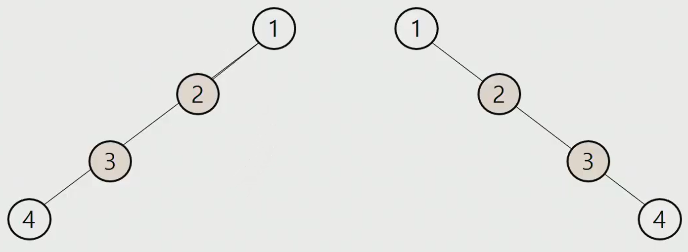
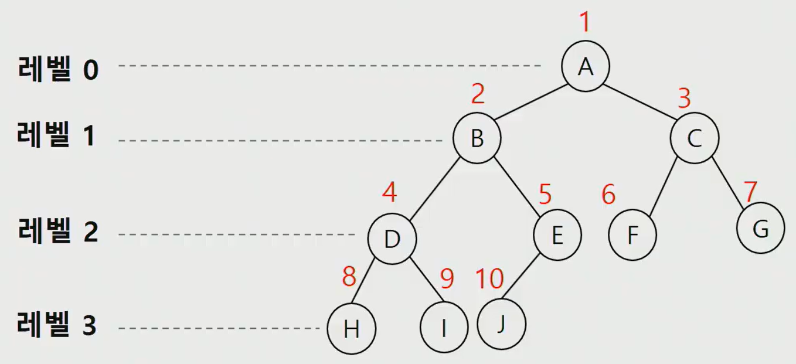
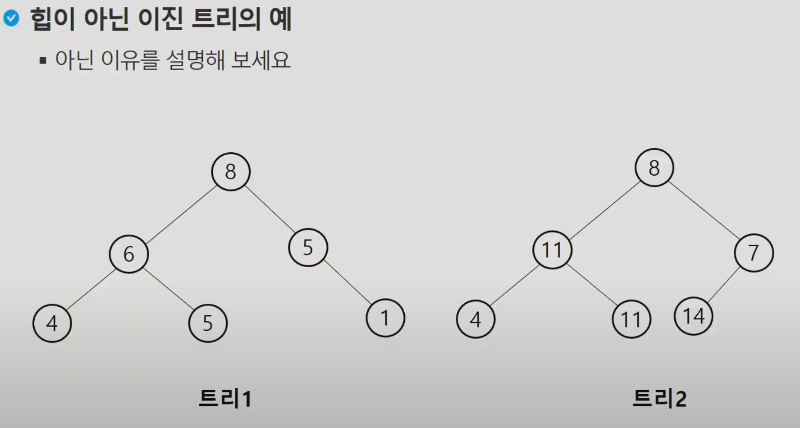

# 8. 트리


## 목차

- 트리
- 이진 트리
- 이진 탐색 트리
- 힙


<br>

----

<br>


## 1. 트리

### 트리의 개념

> - 비선형 구조
> - 원소들 간에 1:n 관계를 가지는 자료구조
> - 원소들 간에 계층관계를 가지는 계층형 자료구조
> - 상위 원소에서 하위 원소로 내려가면서 확장되는 트리(나무)모양의 구조

<br>

### 트리 - 정의

> 
>
> - 한 개 이상의 노드로 이루어진 유한 집합이며 다음 조건을 만족한다.
>   - 노드 중 최상위 노드를 루트(root)라 한다.
>   - 나머지 노드들은 n(>=0)개의 분리집합 T1, ..., Tn으로 분리될 수 있다.
> - 이들 T1, ..., Tn은 각각 하나의 트리가 되며(재귀적 정의) 트리의 부 트리(subtree)라 한다.
>

<br>

### 트리 - 용어 정리

> 	
>
> - 노드(node) - 트리의 원소
>
>   - 트리 T의 노드 - A,B,C,D,E,F,G,H,I,J,K
>
> - 간선(edge)
>
>   - 노드를 연결하는 선
>   - 부모 노드와 자식 노드를 연결
>
> - 루트 노드(root node)
>
>   - 트리의 시작 노드 (부모가 없는 노드)
>   - 트리 T의 루트노드 - A
>
> - 형제 노드(sibling node) - 같은 부모 노드의 자식 노드들
>
>   - B, C, D는 형제 노드
>
> - 조상 노드
>
>   - 간선(edge)를 따라 루트 노드까지 이르는 경로에 있는 모든 노드들
>   - K의 조상 노드 : F, B, A
>
> - 서브 트리(subtree)
>
>   - 부모 노드와 연결된 간선을 끊었을 때 생성되는 트리
>
> - 자손 노드
>
>   - 서브 트리에 있는 하위 레벨의 노드들
>     - B의 자손 노드 : E, F, K
>
> - 차수(degree)
>
>   - 노드의 차수 : 노드에 연결된 자식 노드의 수
>     - B의 차수=2, C의 차수=1
>   - 트리의 차수 : 트리에 있는 노드의 차수 중에서 가장 큰 값
>     - 트리 T의 차수=3
>   - 단말 노드(리프 노드) : 차수가 0인 노드, 자식 노드가 없는 노드
>
> - 높이
>
>   	
>
>   - 노드의 높이 : 루트에서 노드에 이르는 간선의 수 (노드의 레벨)
>     - B의 높이=1, F의 높이=2
>   - 트리의 높이 : 트리에 있는 노드의 높이 중에서 가장 큰 값 (최대 레벨)
>     - 트리 T의 높이=3


<br>

----

<br>


## 2. 이진 트리

### 이진 트리

> - 모든 노드들이 2개의 서브트리를 갖는 특별한 형태의 트리
>
> - 각 노드가 자식 노드를 최대한 2개 까지만 가질 수 있는 트리
>
>   - 왼쪽 자식 노드(left child node)
>   - 오른쪽 자식 노드(right child node)
>
> - 이진 트리의 예
>
>   

<br>

### 이진 트리 - 특성

>- 레벨 i에서의 노드의 최대 개수는 2^i개
>- 높이가 h인 이진 트리가 가질 수 있는 노드의 최소 개수는 (h+1)개가 되며, 최대 개수는 (2^(h+1) - 1)개가 된다.
>
>

<br>

### 이진 트리 - 종류

>**포화 이진 트리(Full Binary Tree)**
>
>- 모든 레벨에 노드가 포화상태로 차 있는 이진 트리
>
>- 높이가 h일 때, 최대의 노드 개수인 (2^(h+1) - 1)의 노드를 가진 이진 트리
>
>  - 높이 3일때 2^(3+1) - 1 = 15개의 노드
>
>- 루트를 1번으로 하여 2^(h+1) - 1까지 정해진 위치에 대한 노드 번호를 가짐
>
>  

>**완전 이진 트리(Complete Binary Tree)**
>
>- 높이가 h이고 노드 수가 n개일 때 (단, h+1 <= n <= 2^(h+1) - 1), 포화 이진 트리의 노드 번호 1번부터 n번까지 빈 자리가 없는 이진 트리
>
>- 예) 노드가 10개인 완전 이진 트리
>
>  

>**편향 이진 트리(Skewed Binary Tree)**
>
>- 높이 h에 대한 최소 개수의 노드를 가지면서 한쪽 방향의 자식 노드만을 가진 이진 트리
>
>  - 왼쪽 편향 이진 트리
>  - 오른쪽 편향 이진 트리
>
>  

<br>

### 이진 트리 - 순회(traversal)

>- 순회(traversal)란 트리의 각 노드를 중복되지 않게 전부 방문(visit)하는 것을 말하는데 트리는 비 선형 구조이기 때문에 선형구조에서와 같이 선후 연결 관계를 알 수 없다.
>
>- 따라서 특별한 방법이 필요하다.
>
>- 순회(traversal) : 트리의 노드들을 체계적으로 방문하는 것
>
>- 3가지의 기본적인 순회방법
>
>  ​	
>
>  - 전위순회(preorder traversal) : VLR
>    - 부모노드 방문 후, 자식노드를 좌->우 순서로 방문
>  - 중위순회(inorder traversal) : LVR
>    - 왼쪽 자식노드->부모노드->오른쪽 자식노드 순으로 방문
>  - 후위순회(postorder traversal) : LRV
>    -  자식노드를 좌우 순서로 방문한 후, 부모노드로 방문

> **전위 순회(preorder traversal)**
>
> - 수행 방법
>
>   1. 현재 노드 n을 방문하여 처리한다. (V)
>   2. 현재 노드 n의 왼쪽 서브트리로 이동한다. (L)
>   3. 현재 노드 n의 오른쪽 서브트리로 이동한다. (R)
>
> - 전위 순회(preorder traversal) 알고리즘
>
>   ```python
>   def preorder_traverse(T):	# 전위 순회
>       if T:	# T가 유효한 노드면
>           visit(T)
>           preorder_traverse(T.left)
>           preorder_traverse(T.right)
>   ```
>
> - 전위순회(preorder traversal) 예
>
>   

>**중위 순회(inorder traversal)**
>
>- 수행 방법
>
>  1. 현재 노드 n의 왼쪽 서브트리로 이동한다. (L)
>  2. 현재 노드 n을 방문하여 처리한다. (V)
>  3. 현재 노드 n의 오른쪽 서브트리로 이동한다. (R)
>
>- 중위 순회 알고리즘
>
>  ```python
>  def inorder_traverse(T):	# 중위 순회
>      if T:	# T가 유효한 노드면
>          inorder_traverse(T.left)
>          visit(T)
>          inorder_traverse(T.right)
>  ```
>
>- 중위 순회(inorder traversal) 예
>
>  

>**후위 순회(postorder traversal)**
>
>- 수행 방법
>
>  1. 현재 노드 n의 왼쪽 서브트리로 이동한다. (L)
>  2. 현재 노드 n의 오른쪽 서브트리로 이동한다. (R)
>  3. 현재 노드 n을 방문하여 처리한다. (V)
>
>- 후위 순회 알고리즘
>
>  ```python
>  def post_traverse(T):	# 후위 순회
>      if T:	# T가 유효한 노드면
>          post_traverse(T.left)
>          post_traverse(T.right)
>          visit(T)
>  ```
>
>- 후위 순회(postorder traversal) 예
>
>  

<br>

### 이진 트리 - 순회(traversal) 연습 문제

>
>
>**이진 트리의 순회**
>
>- 전위 순회 (VLR)
>  - A - B - D - H - I - E - J - C - F - K - G - L - M
>- 중위 순회 (LVR)
>  - H - D - I - B - J - E - A - F - K - C - L - G - M
>- 후위 순회 (LRV)
>  - H - I - D - J - E - B - K - F - L - M - G - C - A

<br>

### 이진 트리의 표현

>**배열을 이용한 이진 트리의 표현**
>
>- 이진 트리에 각 노드 번호를 다음과 같이 부여
>
>- 루트의 번호를 1로 함
>
>- 레벨 n에 있는 노드에 대하여 왼쪽부터 오른족으로 (2^n)부터 (2^(n+1) - 1)까지 번호를 차례로 부여
>
>  

<br>

### 이진 트리의 표현 - 배열을 이용한 이진 트리 표현

> **노드 번호의 성질**
>
> - 노드 번호가 i인 노드의 부모 노드 번호? floor(i/2)
>
> - 노드 번호가 i인 노드의 왼쪽 자식 노드 번호? 2*i
>
> - 노드 번호가 i인 노드의 오른쪽 자식 노드 번호? 2*i + 1
>
> - 레벨 n의 노드 번호 시작 번호? 2^n
>
>   	
>
>   	

> **배열을 이용한 이진 트리의 표현**
>
> - 노드 번호를 배열의 인덱스로 사용
>
> - 높이가 h인 이진 트리를 위한 배열의 크기는?
>
>   - 레벨 i의 최대 노드 수는? 2^i
>   - 따라서 1 + 2 + 4 + 8 + ... + 2^i = 2^(h+1) - 1
>
>   
>
> 

> **배열을 이용한 이진 트리의 표현의 단점**
>
> - 편향 이진 트리의 경우에 사용하지 않는 배열 원소에 대한 메모리 공간 낭비 발생
> - 트리의 중간에 새로운 노드를 삽입하거나 기존의 노드를 삭제할 경우 배열의 크기 변경 어려워 비효율적

<br>

### 트리의 표현 - 연결리스트

> **배열을 이용한 이진 트리의 표현의 단점을 보완하기 위해 연결리스트를 이용하여 트리를 표현할 수 있다.**
>
> **연결 자료구조를 이용한 이진트리의 표현**
>
> - 이진 트리의 모든 노드는 최대 2개의 자식 노드를 가지므로 일정한 구조의 단순 연결 리스트 노드를 사용하여 구현
>
>   	

<br>

### <연습 문제 : 이진 트리>

> - 첫 줄에는 트리의 정점의 총 수 V가 주어진다. 그 다음 줄에는 V-1개 간선이 나열된다. 간선은 그것을 이루는 두 정점으로 표기된다. 간선은 항상 "부모 자식" 순서로 표기된다. 아래 예에서 두 번째 줄 처음 1과 2는 정점 1과 2을 잇는 간선을 의미하며 1이 부모, 2가 자식을 의미한다. 간선은 부모 정점 번호가 작은 것부터 나열되고, 부모 정점이 동일하다면 자식 번호가 작은 것부터 나열된다.
>
> - 다음 이진 트리 표현에 대하여 전위 순회하여 정점의 번호를 출력하시오.
>
>   - 13
>   - 1 2 1 3 2 4 3 5 3 6 4 7 5 8 5 9 6 10 6 11 7 12 11 13
>
>   ```python
>   class MyBinaryTree:
>       # 최대 높이를 받아서 저장할 수 있는 노드의 개수를 지정
>       def __init__(self, H):
>           self.tree = [0] * pow(2, H + 1)
>   
>       # 트리에 데이터 추가
>       def insert(self, parent, child):
>           # 만약에 tree 안에 parent가 없으면
>           # parent는 root, child는 왼쪽자식
>           if parent not in self.tree:
>               self.tree[1] = parent
>               self.tree[2] = child
>           else:   # 부모가 tree안에 있으면
>               # parent의 index를 확인
>               p_idx = self.tree.index(parent)
>               # child를 부모의 왼쪽자식으로 등록하거나 오른쪽자식으로 등록
>               if self.tree[p_idx * 2] == 0:   # 왼쪽자식이 없으면
>                   self.tree[p_idx * 2] = child
>               else:   # 왼쪽자식이 있으면
>                   self.tree[p_idx * 2 + 1] = child
>   
>       def print_tree(self):
>           print(self.tree)
>   
>       # v : 현재노드의 index
>       # 전위순회(pre order traversal)
>       def preorder(self, v):
>           # v가 유효한 index일 때만 수행
>           if v >= len(self.tree):
>               return
>           # 값이 있을 때만 순회
>           if self.tree[v]:
>               print(self.tree[v], end=' ')
>               self.preorder(v * 2)        # 왼쪽 서브트리
>               self.preorder(v * 2 + 1)    # 오른쪽 서브트리
>   
>       # 중위순회(in order traversal)
>       def inorder(self, v):
>           if v >= len(self.tree):
>               return
>           if self.tree[v]:
>               self.inorder(v * 2)
>               print(self.tree[v], end=' ')
>               self.inorder(v * 2 + 1)
>   
>       # 후위순회(post order traversal)
>       def postorder(self, v):
>           if v >= len(self.tree):
>               return
>           if self.tree[v]:
>               self.postorder(v * 2)
>               self.postorder(v * 2 + 1)
>               print(self.tree[v], end=' ')
>   ```
>
>   ```python
>   data = list(map(int, '1 2 1 3 2 4 3 5 3 6 4 7 5 8 5 9 6 10 6 11 7 12 11 13'.split()))
>   H = 4
>   my_tree = MyBinaryTree(H)
>   for i in range(0, len(data), 2):
>       my_tree.insert(data[i], data[i+1])
>   
>   my_tree.print_tree()
>   
>   my_tree.preorder(1)
>   print()
>   my_tree.inorder(1)
>   print()
>   my_tree.postorder(1)
>   ```

<br>

### 수식 트리

> - 수식을 표현하는 이진 트리
> - 수식 이진 트리(Expression Binary Tree)라고 부르기도 함
> - 연산자는 루트 노드이거나 가지 노드
> - 피연산자는 모두 잎 노드

<br>

### 수식 트리의 순회

> 	
>
> - 중위 순회 : A / B * C * D + E
> - 후위 순회 : A B / C * D * E +
> - 전위 순회 : + * * / A B C D E

<br>

----

<br>

## 3. 이진 탐색 트리

### 이진 탐색 트리

> - 탐색 작업을 효율적으로 하기 위한 자료구조
> - 모든 원소는 서로 다른 유일한 키를 갖는다.
> - key(왼쪽 서브트리) < key(루트 노드) < key(오른쪽 서브트리)
> - 왼쪽 서브트리와 오른쪽 서브트리도 이진 탐색 트리다.
> - 중위 순회하면 오름차순으로 정렬된 값을 얻을 수 있다.
>
> 

<br>

### 이진 탐색 트리 - 연산

> **탐색 연산**
>
> - 루트에서 시작한다.
>
> - 탐색할 키 값 x를 루트 노드의 키 값과 비교한다.
>
>   - (키 값 x  = 루트노드의 키 값)인 경우 : 원하는 원소를 찾았으므로 탐색연산 성공
>   - (키 값 x < 루트노드의 키 값)인 경우 : 루트노드의 왼쪽 서브트리에 대해서 탐색연산 수행
>   - (키 값 x > 루트노드의 키 값)인 경우 : 루트노드의 오른쪽 서브트리에 대해서 탐색연산 수행
>
> - 서브트리에 대해서 순환적으로 탐색 연산을 반복한다.
>
> - 13 탐색
>
>   

> **삽입 연산**
>
> 1. 먼저 탐색 연산을 수행
>
>    - 삽입할 원소와 같은 원소가 트리에 있으면 삽입할 수 없으므로, 같은 원소가 트리에 있는지 탐색하여 확인한다.
>    - 탐색에서 탐색 실패가 결정되면 위치가 삽입 위치가 된다.
>
> 2. 탐색 실패한 위치에 원소를 삽입한다.
>
>    - 다음 예는 5를 삽입하는 예이다.
>
>    

<br>

### 이진 탐색 트리 - 성능

> **탐색(searching), 삽입(insertion), 삭제(deletion) 시간은 트리의 높이 만큼 시간이 걸린다.**
>
> - O(h), h : BST의 깊이(height)
>
> **평균의 경우**
>
> - 이진 트리가 균형적으로 생성되어 있는 경우
> - O(log n)
>
> **최악의 경우**
>
> - 한쪽으로 치우진 경사 이진트리의 경우
> - O(n)
> - 순차탐색과 시간복잡도가 같다.

> **검색 알고리즘의 비교**
>
> - 배열에서의 순차 검색 : O(N)
> - 정렬된 배열에서의 순차 검색 : O(N)
> - 정렬된 배열에서의 이진탐색 : O(logN)
>   - 고정 배열 크기와 삽입, 삭제 시 추가 연산 필요
> - 이진 탐색에서의 평균 : O(logN)
>   - 최악의 경우 : O(N)
>   - 완전 이진 트리 도는 균형트리로 바꿀 수 있다면 최악의 경우를 없앨 수 있다.
>     - 새로운 원소를 삽입할 때 삽입 시간을 줄인다.
>     - 평균과 최악의 시간이 같다. O(logN)
> - 해쉬 검색 : O(1)
>   - 추가 저장 공간이 필요
>
> **상용에서 검색을 위해 어떤 알고리즘을 사용할까?**

<br>

### 이진 탐색 트리 - 연산 연습

> **삭제 연산**
>
> - 삭제 연산에 대해 알고리즘을 생각
>
> - 다음 트리에 대하여 13, 12, 9를 차례로 삭제해 보자.
>
>   ​	


<br>

----

<br>


## 4. 힙(Heap)

### 힙(heap)

> **완전 이진 트리에 있는 노드 중에서 키 값이 가장 큰 노드나 키 값이 가장 작은 노드를 찾기 위해서 만든 자료구조**
>
> **최대 힙(max heap)**
>
> - 키값이 가장 큰 노드를 찾기 위한 **완전 이진 트리**
> - {부모노드의 키값 > 자식노드의 키값}
> - 루트 노드 : 키값이 가장 큰 노드
>
> **최소 힙(min heap)**
>
> - 키값이 가장 작은 노드를 찾기 위한 **완전 이진 트리**
> - {부모노드의 키값 < 자식노드의 키값}
> - 루트 노드 : 키값이 가장 작은 노드
>
> 
>
> 

<br>

### 힙 연산 - 삽입

> 
>
> 

<br>

### 힙 연산 - 삭제

> **힙에서는 루트 노드의 원소만을 삭제할 수 있다.**
>
> **루트 노드의 원소를 삭제하여 반환한다.**
>
> **입의 종류에 따라 최대값 또는 최소값을 구할 수 있다.**
>
> 

<br>

### 힙을 이용한 우선순위 큐

> **힙(Heap)**
>
> - 완전 이진 트리로 구현된 자료구조로서, 키값이 가장 큰 노드나 가장 작은 노드를 찾기에 용이한 자료구조
>
> - 아래의 예는 최소 힙(Min heap)으로서, 가장 작은 키값을 가진 노드가 항상 루트에 위치한다.
>
>   ​	
>
> - 힙의 키를 우선순위로 활용하여 우선순위 큐를 구현할 수 있다.