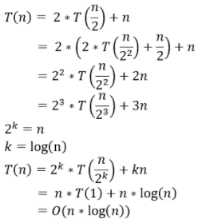

# Merge Sort (병합 정렬)


## Merge Sort 기본 개념

1. 리스트의 길이가 1 이하이면 이미 정렬된 것으로 본다. 그렇지 않은 경우에는
2. 분할(divide) : 정렬되지 않은 리스트를 절반으로 잘라 비슷한 크기의 두 부분 리스트로 나눈다.
3. 정복 (cnoquer) : 각 부분 리스트를 재귀적으로 합병 정렬을 이용해 정렬한다.
4. 결합 (combine) : 두 부분 리스트를 다시 하나의 정렬된 리스트로 병합한다.


## 소스 코드

```python
def merge_sort(arr, n):
    if n == 1: return arr
	
    # 분할(divide) : 부분 리스트 나누기
    mid = n // 2
    left_arr = arr[:mid]
    right_arr = arr[mid:]
    
    # 정복(conquer) : 각 부분 리스트 재귀적으로 병합 정렬
    sorted_left_arr = merge_sort(left_arr, len(left_arr))
    sorted_right_arr = merge_sort(right_arr, len(right_arr))
	
    # 결합 (combine) : 두 부분 리스트를 하나의 정렬된 리스트로 병합
    for i in range(len(arr)):
    	# 한 부분 리스트에 원소가 없으면 원소가 있는 부분 리스트의 값을 넣는다.
        if len(sorted_left_arr) == 0:
            arr[i] = sorted_right_arr.pop(0)
        elif len(sorted_right_arr) == 0:
            arr[i] = sorted_left_arr.pop(0)
        # 두 부분 리스트의 가장 작은 값을 비교하면서 정렬한다.
        elif sorted_left_arr[0] < sorted_right_arr[0]:
            arr[i] = sorted_left_arr.pop(0)
        else:
            arr[i] = sorted_right_arr.pop(0)
            
    return arr
```


## 시간 복잡도 계산

	